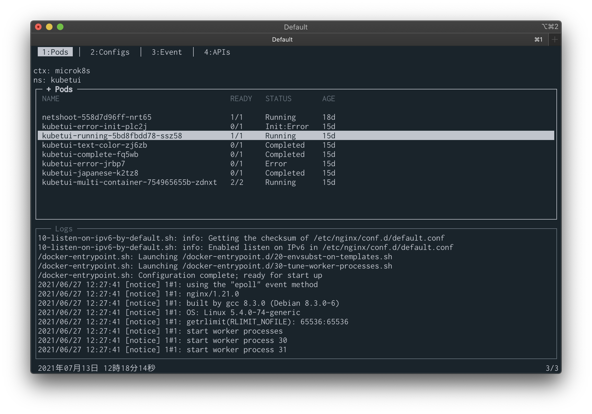
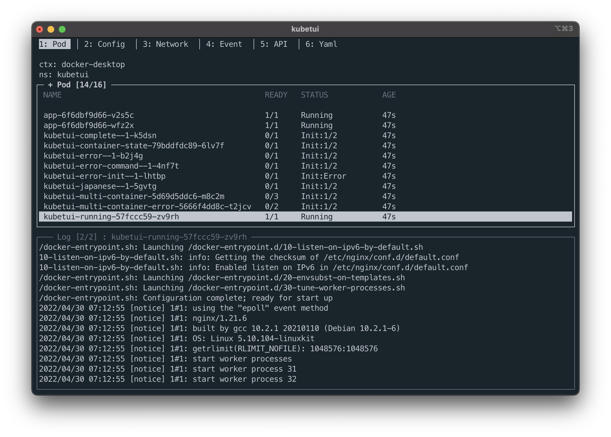
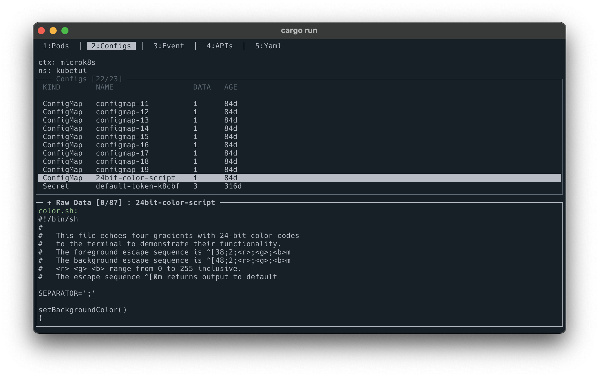
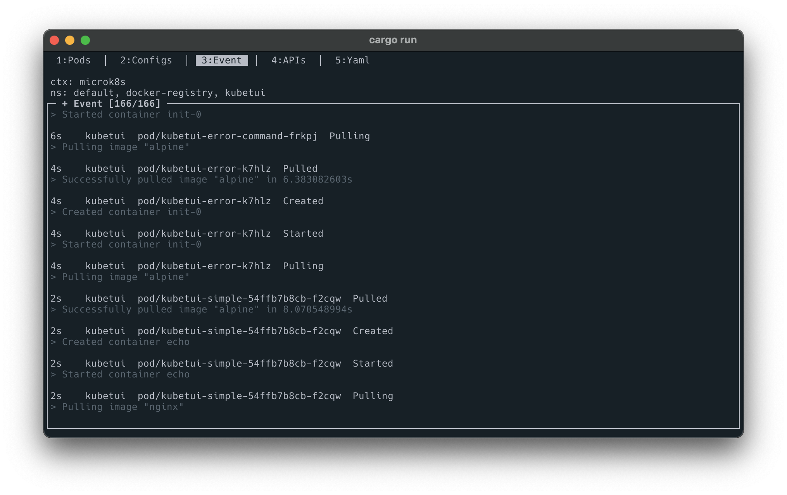
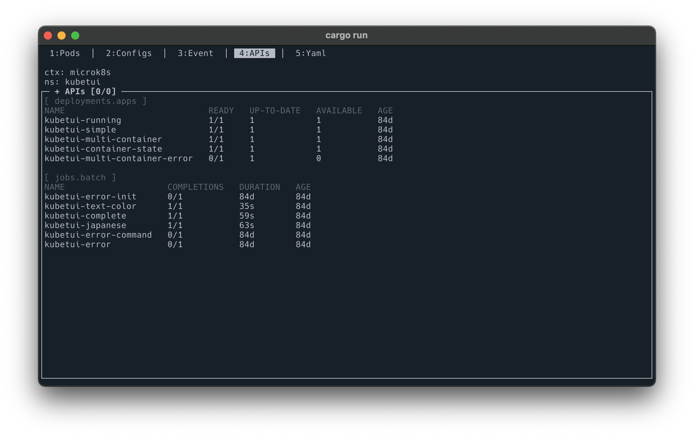
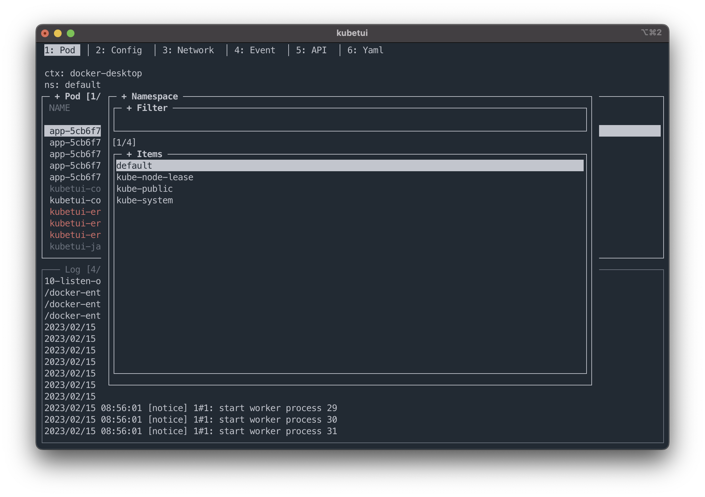
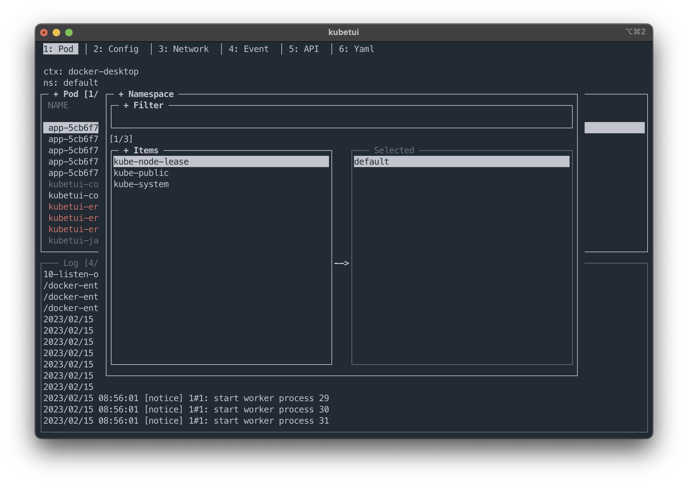
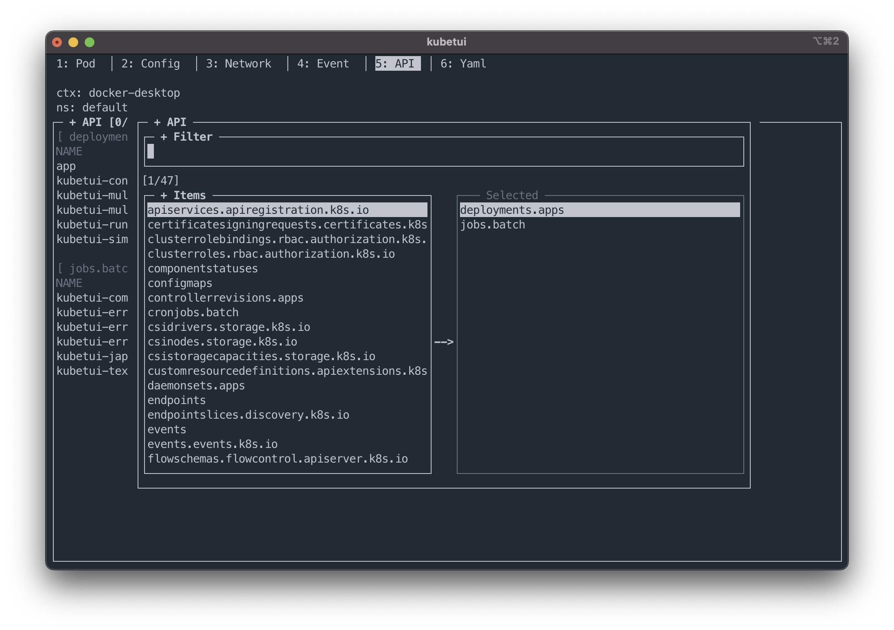

# kubetui

Kubernetes resource watching tool




## Features

- Pods list and container logs watching
- ConfigMap and secret watching, and data decoding
- Events watching
- Specific resources watching
- Namespace multiple selections
- Support unix like key bindings
- Support mouse event

## Command Option

```sh
USAGE:
    kubetui [OPTIONS]

FLAGS:
    -h, --help       Prints help information
    -V, --version    Prints version information

OPTIONS:
    -s, --split-mode <direction>
            Window split mode [default: vertical]
            [possible values: vertical, v, horizontal, h]
```

## Key Bindings

General

| Key                                  | Description                                                             |
| ------------------------------------ | ----------------------------------------------------------------------- |
| <kbd>n</kbd>                         | Open the popup for selecting the namespace                              |
| <kbd>Shift+n</kbd>                   | Open the popup for selecting multiple namespaces                        |
| <kbd>f</kbd>, <kbd>/</kbd>           | Open the popup for selecting multiple api-resources (**only APIs tab**) |
| <kbd>Tab</kbd>, <kbd>Shift+Tab</kbd> | Change the focus of view within the active tab                          |
| <kbd>number</kbd>                    | Switch the tab (number: 1~4)                                            |
| <kbd>ESC</kbd>                       | Close the window, or terminate the app (when the popup is not opening)  |
| <kbd>q</kbd>                         | Terminate the app                                                       |

View control

| Key                                                                                                  | Description                                        |
| ---------------------------------------------------------------------------------------------------- | -------------------------------------------------- |
| <kbd>j</kbd>, <kbd>k</kbd>,<br> <kbd>Down</kbd>, <kbd>Up</kbd>,<br> <kbd>PgDn</kbd>, <kbd>PgUp</kbd> | Change the item to select / Scroll the view        |
| <kbd>Left</kbd>, <kbd>Right</kbd>                                                                    | Scroll horizontally on the view                    |
| <kbd>g</kbd>                                                                                         | Go to the first item / Go to the top of the view   |
| <kbd>G</kbd>                                                                                         | Go to the last item / Go to the bottom of the view |

Popup window (exist input form)

| Key                                                                  | Description                                                            |
| -------------------------------------------------------------------- | ---------------------------------------------------------------------- |
| <kbd>Down</kbd>, <kbd>Up</kbd>,<br> <kbd>PgDn</kbd>, <kbd>PgUp</kbd> | Change the item to select / Scroll the view                            |
| <kbd>Tab</kbd>, <kbd>Shift+Tab</kbd>                                 | Change the focus of view within the active tab                         |
| <kbd>Enter</kbd>                                                     | Select item, and trigger event                                         |
| <kbd>ESC</kbd>                                                       | Close the window, or terminate the app (when the popup is not opening) |
| Input form                                                           |                                                                        |
| <kbd>Home</kbd>                                                      | Move the cursor to the start                                           |
| <kbd>End</kbd>                                                       | Move the cursor to the end                                             |
| <kbd>Ctrl+w</kbd>                                                    | Delete the text from the cursor position to the start                  |
| <kbd>Ctrl+k</kbd>                                                    | Delete the text from the cursor position to the end                    |
| <kbd>Left</kbd>, <kbd>Right</kbd>                                    | Move the cursor to a (back, forward) character                         |

## Key map

| Source                                  | Destination       |
| --------------------------------------- | ----------------- |
| <kbd>Ctrl+p</kbd>                       | <kbd>Up</kbd>     |
| <kbd>Ctrl+n</kbd>                       | <kbd>Down</kbd>   |
| <kbd>Ctrl+f</kbd>                       | <kbd>Right</kbd>  |
| <kbd>Ctrl+b</kbd>                       | <kbd>Left</kbd>   |
| <kbd>Ctrl+u</kbd>                       | <kbd>PgUp</kbd>   |
| <kbd>Ctrl+d</kbd>                       | <kbd>PgDn</kbd>   |
| <kbd>Ctrl+h</kbd>, <kbd>Backspace</kbd> | <kbd>Delete</kbd> |
| <kbd>Ctrl+a</kbd>                       | <kbd>Home</kbd>   |
| <kbd>Ctrl+e</kbd>                       | <kbd>End</kbd>    |
| <kbd>Ctrl+[</kbd>                       | <kbd>Esc</kbd>    |

## Screenshots

### Watch Resources

pods list / log



ConfigMap / Secret



Events



APIs




### Select Items

Select namespaces (single)



Select namespaces (multiple)



Select apis


