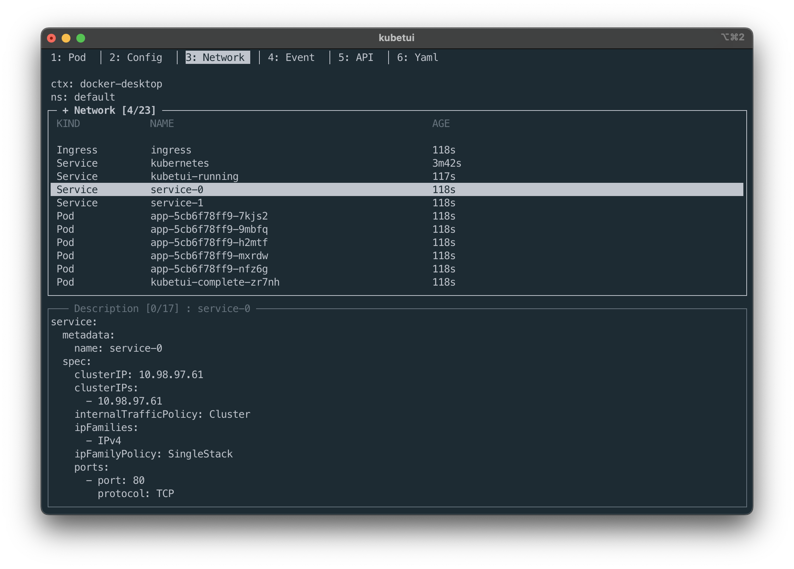
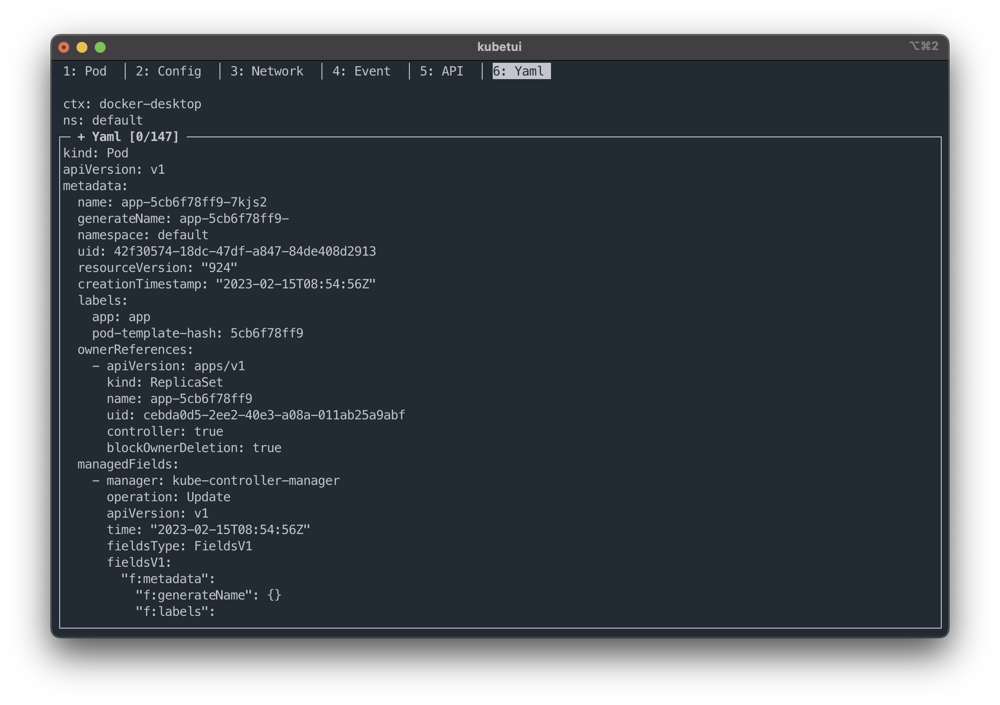
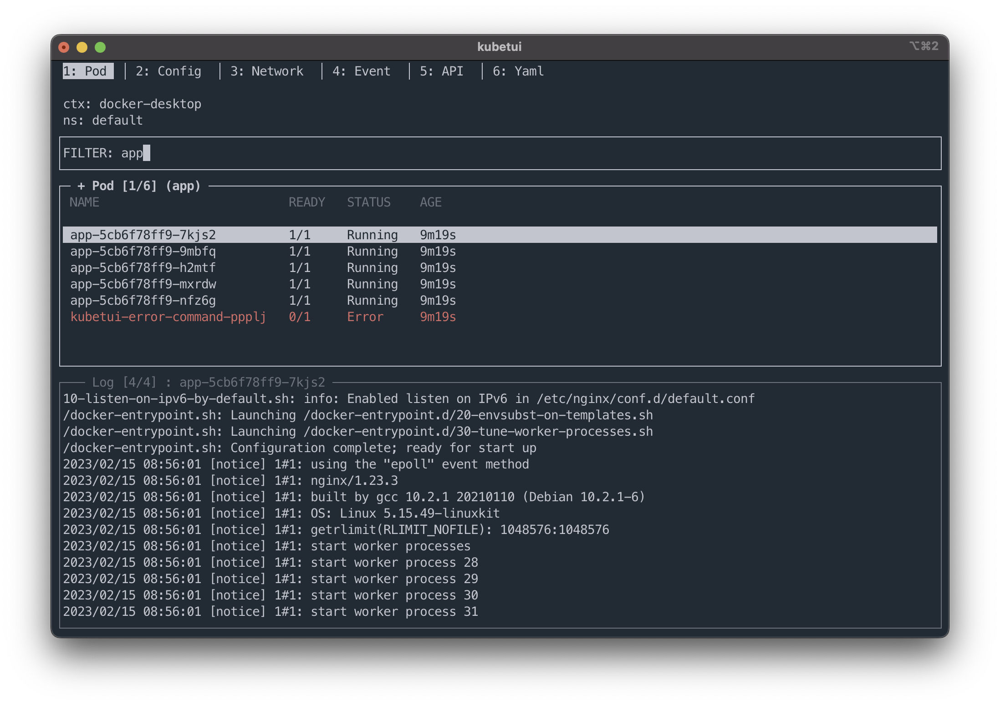
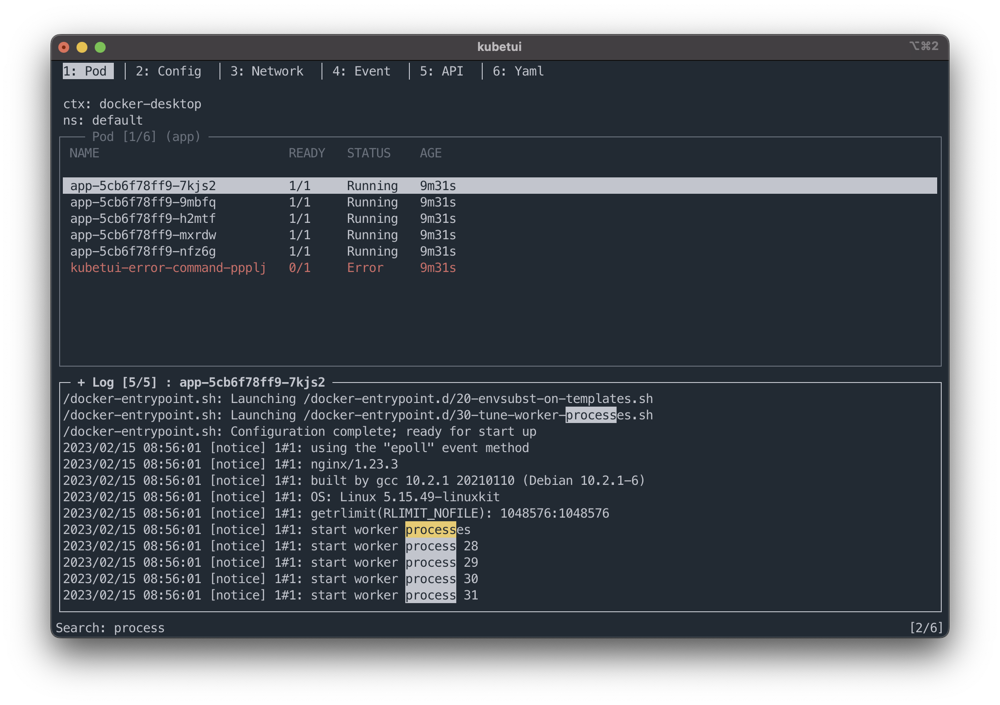

# kubetui

[]()
[](https://github.com/sarub0b0/kubetui/actions/workflows/test.yml)

This is a TUI tool for monitoring kubernetes resources.


## Installation

Please download a binary from [github release](https://github.com/sarub0b0/kubetui/releases).

## Features

- Pods list and container logs watching
- ConfigMap and secret watching, and data decoding
- Network related resources list and description
- Events watching
- Specific resources watching (Table / Yaml)
- Namespace multiple selections
- Context selection
- Support clipboard (only mouse action)
- Support mouse event
- Search word
- Filter items (multiple words with space delimited)

## Command Option

```sh
kubernetes terminal user interface

Usage: kubetui [OPTIONS]

Options:
  -h, --help                           Print help information
  -V, --version                        Print version information
  -A, --all-namespaces[=<true|false>]  Select all namespaces [default: false]
  -c, --context <CONTEXT>              Context
  -C, --kubeconfig <KUBECONFIG>        kubeconfig path
  -l, --logging                        Logging
  -n, --namespaces <NAMESPACES>        Namespaces (e.g. -n val1,val2,val3 | -n val1 -n val2 -n val3)
  -s, --split-mode <v|h>               Window split mode [possible values: v, h, vertical, horizontal]
```

## Key Bindings

### General

| Key                                  | Description                                                                    |
| ------------------------------------ | ------------------------------------------------------------------------------ |
| <kbd>h</kbd>, <kbd>?</kbd>           | Open the popup for help                                                        |
| <kbd>Enter</kbd>                     | Select item, and trigger event                                                 |
| <kbd>n</kbd>                         | Open the popup for selecting the namespace                                     |
| <kbd>N</kbd>                         | Open the popup for selecting the namespaces                                    |
| <kbd>c</kbd>                         | Open the popup for selecting the context                                       |
| <kbd>Shift+n</kbd>                   | Open the popup for selecting multiple namespaces                               |
| <kbd>Tab</kbd>, <kbd>Shift+Tab</kbd> | Change the focus of view within the active tab                                 |
| <kbd>number</kbd>                    | Switch the tab (number: 1~6)                                                   |
| <kbd>ESC</kbd>                       | Close the window, or terminate the app (when the popup is not opening)         |
| <kbd>q</kbd>                         | Terminate the app                                                              |
| <kbd>f</kbd>                         | Open the popup for selecting multiple api-resources (**only APIs / Yaml tab**) |

### View control

| Key                                                                                                  | Description                                        |
| ---------------------------------------------------------------------------------------------------- | -------------------------------------------------- |
| <kbd>j</kbd>, <kbd>k</kbd>,<br> <kbd>Down</kbd>, <kbd>Up</kbd>,<br> <kbd>PgDn</kbd>, <kbd>PgUp</kbd> | Change the item to select / Scroll the view        |
| <kbd>Left</kbd>, <kbd>Right</kbd>                                                                    | Scroll horizontally on the view                    |
| <kbd>g</kbd>                                                                                         | Go to the first item / Go to the top of the view   |
| <kbd>G</kbd>                                                                                         | Go to the last item / Go to the bottom of the view |

### View specific

#### Text view

| Key                          | Description                                                              |
| ---------------------------- | ------------------------------------------------------------------------ |
| <kbd>/</kbd>                 | Activate search mode, open search form                                   |
| <kbd>Enter</kbd>             | Confirm input                                                            |
| <kbd>q</kbd>, <kbd>Esc</kbd> | Disable search mode, close search form (**when search mode is enabled**) |

**Search mode**

| Key                          | Description                |
| ---------------------------- | -------------------------- |
| <kbd>n</kbd> ,<kbd>N</kbd>   | Goto next / previous match |
| <kbd>q</kbd> ,<kbd>Esc</kbd> | Disable search mode        |

#### Table view

| Key                              | Description       |
| -------------------------------- | ----------------- |
| <kbd>/</kbd>                     | Open filter form  |
| <kbd>Enter</kbd>, <kbd>ESC</kbd> | Close filter form |

#### Popup

| Key                                                                  | Description                                                            |
| -------------------------------------------------------------------- | ---------------------------------------------------------------------- |
| <kbd>Down</kbd>, <kbd>Up</kbd>,<br> <kbd>PgDn</kbd>, <kbd>PgUp</kbd> | Change the item to select / Scroll the view                            |
| <kbd>Tab</kbd>, <kbd>Shift+Tab</kbd>                                 | Change the focus of view within the active tab                         |
| <kbd>Enter</kbd>                                                     | Select item, and trigger event                                         |
| <kbd>ESC</kbd>                                                       | Close the window, or terminate the app (when the popup is not opening) |

#### Input form

| Key                               | Description                                           |
| --------------------------------- | ----------------------------------------------------- |
| <kbd>Home</kbd>                   | Move the cursor to the start                          |
| <kbd>End</kbd>                    | Move the cursor to the end                            |
| <kbd>Ctrl+w</kbd>                 | Delete the text from the cursor position to the start |
| <kbd>Ctrl+k</kbd>                 | Delete the text from the cursor position to the end   |
| <kbd>Left</kbd>, <kbd>Right</kbd> | Move the cursor to a (back, forward) character        |

## Key map

| Source                                  | Destination       |
| --------------------------------------- | ----------------- |
| <kbd>Ctrl+p</kbd>                       | <kbd>Up</kbd>     |
| <kbd>Ctrl+n</kbd>                       | <kbd>Down</kbd>   |
| <kbd>Ctrl+f</kbd>                       | <kbd>Right</kbd>  |
| <kbd>Ctrl+b</kbd>                       | <kbd>Left</kbd>   |
| <kbd>Ctrl+u</kbd>                       | <kbd>PgUp</kbd>   |
| <kbd>Ctrl+d</kbd>                       | <kbd>PgDn</kbd>   |
| <kbd>Ctrl+h</kbd>, <kbd>Backspace</kbd> | <kbd>Delete</kbd> |
| <kbd>Ctrl+a</kbd>                       | <kbd>Home</kbd>   |
| <kbd>Ctrl+e</kbd>                       | <kbd>End</kbd>    |
| <kbd>Ctrl+[</kbd>                       | <kbd>Esc</kbd>    |

## Contributing

Bug reports and pull requests are welcome.

## License

This software is available as open source under the terms of the [MIT License](https://opensource.org/licenses/MIT).

## Screenshots

### Watch Resources

1. pods list / container logs
   

1. ConfigMap / Secret
   

1. Network
   

1. Events
   

1. APIs
   

1. Yaml
   

### Select Items

1. Select namespace
   

1. Select namespaces (multiple)
   

1. Select apis
   

### Filter items



### Search word


