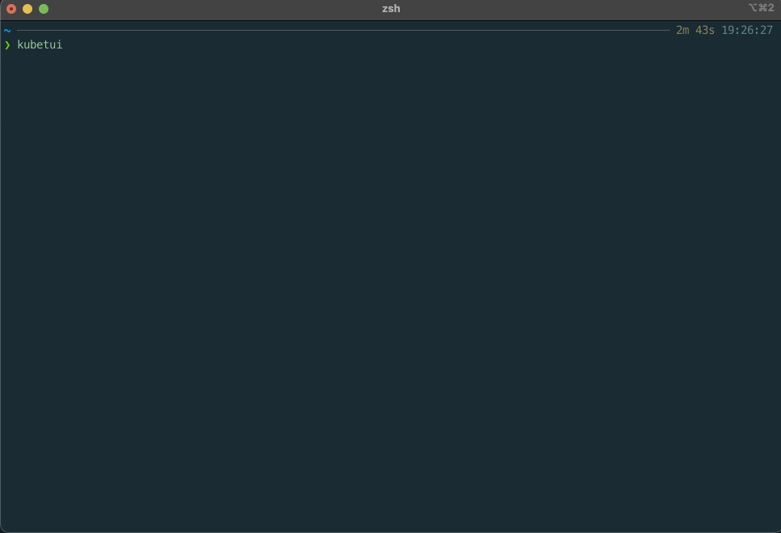

# kubetui

[]()
[](https://github.com/sarub0b0/kubetui/actions/workflows/test.yml)

Kubetui is a terminal user interface (TUI) tool designed for monitoring Kubernetes resources.  
It provides an easy-to-use interface for developers and operators to access important information about their applications and infrastructure.

<details>
<summary>Table of Contents</summary>

- [Installation](#installation)
- [Features](#features)
- [Usage](#usage)
- [Key Bindings](#key-bindings)
  - [General](#general)
  - [Key Map](#key-map)
  - [View Control](#view-control)
  - [Text View](#text-view)
  - [Search Mode](#search-mode)
  - [Table View](#table-view)
  - [Popup](#popup)
  - [Input Form](#input-form)
- [Contributing](#contributing)
- [License](#license)

</details>



## Installation

To install kubetui, download the binary from the [github release page](https://github.com/sarub0b0/kubetui/releases).

## Features

Kubetui offers the following features to help you monitor and manage your Kubernetes resources:

- **Pods List and Container Logs**: Easily view a list of pods and their container logs.
- **ConfigMap and Secret Watching**: Monitor ConfigMaps and secrets, and decode their data.
- **Network-related Resources**: Explore a list of network-related resources and their descriptions.
- **Events Watching**: Stay updated with a real-time view of Kubernetes events.
- **Specific Resources Watching (List / YAML)**: View specific resources in list or YAML format.
- **Namespace Multiple Selections**: Select and view multiple namespaces simultaneously.
- **Context Selection**: Change the Kubernetes context you want to operate on.
- **Clipboard Support (Text Copy)**: Copy text conveniently using mouse actions.
- **Mouse Event Support**: Leverage mouse events for a smoother user experience.
- **Search Functionality**: Easily search for specific keywords within the interface.
- **Item Filtering**: Filter items based on multiple keywords separated by spaces.

Overall, kubetui is a powerful tool designed to provide a safe and efficient way to access and monitor your Kubernetes resources. With its user-friendly interface and comprehensive features, it simplifies the process of managing your applications and infrastructure.

## Usage

```sh
kubetui
```

```sh
$ kubetui -h
kubernetes terminal user interface

Usage: kubetui [OPTIONS]

Options:
  -h, --help                           Print help information
  -V, --version                        Print version information
  -A, --all-namespaces[=<true|false>]  Select all namespaces [default: false]
  -c, --context <CONTEXT>              Context
  -C, --kubeconfig <KUBECONFIG>        kubeconfig path
  -l, --logging                        Logging
  -n, --namespaces <NAMESPACES>        Namespaces (e.g. -n val1,val2,val3 | -n val1 -n val2 -n val3)
  -s, --split-mode <v|h>               Window split mode [possible values: v, h, vertical, horizontal]
```

## Key Bindings

### General

| Key                                  | Description                                                        |
| ------------------------------------ | ------------------------------------------------------------------ |
| <kbd>h</kbd>, <kbd>?</kbd>           | Open the popup for help                                            |
| <kbd>Enter</kbd>                     | Select an item and trigger an event                                |
| <kbd>n</kbd>                         | Open the popup for selecting the namespace                         |
| <kbd>N</kbd>                         | Open the popup for selecting multiple namespaces                   |
| <kbd>c</kbd>                         | Open the popup for selecting the context                           |
| <kbd>Tab</kbd>, <kbd>Shift+Tab</kbd> | Change the focus of the view within the active tab                 |
| <kbd>number</kbd>                    | Switch to the tab (number: 1~6)                                    |
| <kbd>ESC</kbd>                       | Close the window or terminate the app (when the popup is not open) |
| <kbd>q</kbd>                         | Terminate the app                                                  |
| <kbd>f</kbd>                         | Open the popup for selecting multiple API resources                |

### Key Map

| Source                                  | Destination       |
| --------------------------------------- | ----------------- |
| <kbd>Ctrl+p</kbd>                       | <kbd>Up</kbd>     |
| <kbd>Ctrl+n</kbd>                       | <kbd>Down</kbd>   |
| <kbd>Ctrl+f</kbd>                       | <kbd>Right</kbd>  |
| <kbd>Ctrl+b</kbd>                       | <kbd>Left</kbd>   |
| <kbd>Ctrl+u</kbd>                       | <kbd>PgUp</kbd>   |
| <kbd>Ctrl+d</kbd>                       | <kbd>PgDn</kbd>   |
| <kbd>Ctrl+h</kbd>, <kbd>Backspace</kbd> | <kbd>Delete</kbd> |
| <kbd>Ctrl+a</kbd>                       | <kbd>Home</kbd>   |
| <kbd>Ctrl+e</kbd>                       | <kbd>End</kbd>    |
| <kbd>Ctrl+[</kbd>                       | <kbd>Esc</kbd>    |

### View Control

| Key                                                                                          | Description                                        |
| -------------------------------------------------------------------------------------------- | -------------------------------------------------- |
| <kbd>j</kbd>, <kbd>k</kbd>, <kbd>Down</kbd>, <kbd>Up</kbd>, <kbd>PgDn</kbd>, <kbd>PgUp</kbd> | Change the selected item / Scroll the view         |
| <kbd>Left</kbd>, <kbd>Right</kbd>                                                            | Scroll horizontally in the view                    |
| <kbd>g</kbd>                                                                                 | Go to the first item / Go to the top of the view   |
| <kbd>G</kbd>                                                                                 | Go to the last item / Go to the bottom of the view |

### Text View

| Key                          | Description                                                                    |
| ---------------------------- | ------------------------------------------------------------------------------ |
| <kbd>/</kbd>                 | Activate search mode and open the search form                                  |
| <kbd>Enter</kbd>             | Confirm the input                                                              |
| <kbd>q</kbd>, <kbd>Esc</kbd> | Disable search mode and close the search form (**when search mode is active**) |

### Search Mode

| Key                          | Description                     |
| ---------------------------- | ------------------------------- |
| <kbd>n</kbd>, <kbd>N</kbd>   | Go to the next / previous match |
| <kbd>q</kbd>, <kbd>Esc</kbd> | Disable search mode             |

### Table View

| Key                              | Description           |
| -------------------------------- | --------------------- |
| <kbd>/</kbd>                     | Open the filter form  |
| <kbd>Enter</kbd>, <kbd>ESC</kbd> | Close the filter form |

### Popup

| Key                                                              | Description                                                        |
| ---------------------------------------------------------------- | ------------------------------------------------------------------ |
| <kbd>Down</kbd>, <kbd>Up</kbd>, <kbd>PgDn</kbd>, <kbd>PgUp</kbd> | Change the selected item / Scroll the view                         |
| <kbd>Tab</kbd>, <kbd>Shift+Tab</kbd>                             | Change the focus of the view within the active tab                 |
| <kbd>Enter</kbd>                                                 | Select an item and trigger an event                                |
| <kbd>ESC</kbd>                                                   | Close the window or terminate the app (when the popup is not open) |

### Input Form

| Key                               | Description                                      |
| --------------------------------- | ------------------------------------------------ |
| <kbd>Home</kbd>                   | Move the cursor to the beginning                 |
| <kbd>End</kbd>                    | Move the cursor to the end                       |
| <kbd>Ctrl+w</kbd>                 | Delete text from the cursor to the beginning     |
| <kbd>Ctrl+k</kbd>                 | Delete text from the cursor to the end           |
| <kbd>Left</kbd>, <kbd>Right</kbd> | Move the cursor to the previous / next character |

## Contributing

Bug reports and pull requests are welcome.

## License

This software is available as open source under the terms of the [MIT License](https://opensource.org/licenses/MIT).
