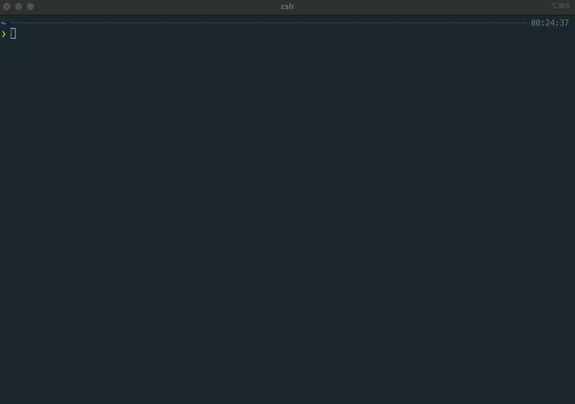

# kubetui

[]()
[](https://github.com/sarub0b0/kubetui/actions/workflows/test.yml)

Kubetui is a terminal user interface (TUI) tool designed for monitoring Kubernetes resources.  
It provides an easy-to-use interface for developers and operators to access important information about their applications and infrastructure.

<details>
<summary>Table of Contents</summary>

- [Features](#features)
- [Installation](#installation)
  - [Homebrew on macOS and Linux](#homebrew-on-macos-and-linux)
  - [Pacman on Arch Linux](#pacman-on-arch-linux)
  - [Scoop on Windows](#scoop-on-windows)
  - [WinGet on Windows](#winget-on-windows)
  - [Chocolatey on Windows](#chocolatey-on-windows)
  - [openSUSE Tumbleweed](#opensuse-tumbleweed)
  - [Using `cargo install`](#using-cargo-install)
  - [Downloading the binary](#downloading-the-binary)
- [Usage](#usage)
  - [Pod Column Customization](#pod-column-customization)
  - [Shell Completion](#shell-completion)
  - [Custom Configuration](#custom-configuration)
- [Log Query](#log-query)
  - [Usage Example](#usage-example)
  - [Supported Queries](#supported-queries)
  - [Query String Escaping](#query-string-escaping)
- [Key Bindings](#key-bindings)
  - [General](#general)
  - [Key Map](#key-map)
  - [View Control](#view-control)
  - [Text View](#text-view)
  - [Search Mode](#search-mode)
  - [Table View](#table-view)
  - [Dialog](#dialog)
  - [Input Form](#input-form)
  - [Container Logs View](#container-logs-view)
- [Contributing](#contributing)
- [License](#license)

</details>



<details>
<summary>Demo slow version</summary>


</details>

## Features

Kubetui offers the following features to help you monitor and manage your Kubernetes resources:

- **Pods List and Container Logs**:
  - View a list of pods and their container logs.
  - JSON logs display mode switching: toggle between pretty print and single-line display using the <kbd>f</kbd> or <kbd>p</kbd> keys.
  - **(new) Customizable pod columns**: Use `--pod-columns` to control which columns are shown in the pod table view. Supports comma-separated lists or `full` to show all columns.
- **ConfigMap and Secret Watching**: Monitor ConfigMaps and secrets, and decode their data.
- **Network-related Resources**: Explore a list of network-related resources and their descriptions.
- **Events Watching**: Stay updated with a real-time view of Kubernetes events.
- **Specific Resources Watching (List / YAML)**: View specific resources in list or YAML format.
- **Namespace Multiple Selections**: Select and view multiple namespaces simultaneously.
- **Context Selection**: Change the Kubernetes context you want to operate on.
- **Clipboard Support (Text Copy)**: Copy text conveniently using mouse actions.
- **Mouse Event Support**: Leverage mouse events for a smoother user experience.
- **Search Functionality**: Easily search for specific keywords within the interface.
- **Item Filtering**: Filter items based on multiple keywords separated by spaces.
- **(beta) Customizable UI Appearance**: Modify the appearance of the UI, including border styles, colors, and text attributes.

Overall, kubetui is a powerful tool designed to provide a safe and efficient way to access and monitor your Kubernetes resources. With its user-friendly interface and comprehensive features, it simplifies the process of managing your applications and infrastructure.

## Installation

[](https://repology.org/project/kubetui/versions)

To install kubetui, you can use the following methods:

### [Homebrew](https://brew.sh/) on macOS and Linux

Kubetui is available on homebrew, the package manager for macOS and Linux. Install it by running the following command:

```shell
brew install kubetui
```

### [Pacman](https://wiki.archlinux.org/title/pacman) on Arch Linux

Kubetui is available in the [official repositories](https://archlinux.org/packages/extra/x86_64/kubetui/). Install it by running the following command:

```shell
pacman -S kubetui
```

### [Scoop](https://scoop.sh/) on Windows

If you are using Windows with scoop, you can add the necessary buckets and install kubetui with the following commands:

```shell
# Add the 'extras' bucket for vcredist2022
scoop bucket add extras
scoop bucket add <bucket> https://github.com/sarub0b0/scoop-bucket
scoop install <bucket>/kubetui
```

### [WinGet](https://github.com/microsoft/winget-cli) on Windows

If you prefer using winget, the Windows package manager, you can install kubetui with the following command:

```shell
winget install kubetui
```

### [Chocolatey](https://community.chocolatey.org/packages/kubetui/) on Windows

Kubetui is available on Chocolatey, the package manager for Windows. Install it by running the following command:

```shell
choco install kubetui
```

### openSUSE Tumbleweed

For openSUSE Tumbleweed, you can install kubetui using the `zypper` package manager. Run the following command to install:

```shell
zypper install kubetui
```

### Using `cargo install`

Kubetui is available on [crates.io](https://crates.io/crates/kubetui), the official Rust package registry. Install it by running the following command:

```shell
cargo install kubetui
```

Make sure you have [Rust](https://www.rust-lang.org/tools/install) and [Cargo](https://doc.rust-lang.org/cargo/getting-started/installation.html) installed before running the command.

### Downloading the binary

Alternatively, you can download the precompiled binary from the [GitHub Release page](https://github.com/sarub0b0/kubetui/releases) that matches your operating system. Once downloaded, you can run the binary directly without any additional installation steps.

Choose the method that suits your needs and preferences.

## Usage

```sh
kubetui
```

```sh
$ kubetui -h
An intuitive Terminal User Interface (TUI) tool for real-time monitoring and exploration of Kubernetes resources.

Usage: kubetui [OPTIONS] [COMMAND]

Commands:
  completion  Generate completion script

Options:
  -h, --help                           Print help
  -V, --version                        Print version
  -A, --all-namespaces[=<true|false>]  Select all namespaces [default: false]
  -c, --context <CONTEXT>              Context
  -C, --kubeconfig <KUBECONFIG>        kubeconfig path
      --config-file <CONFIG_FILE>      Config file path
  -l, --logging                        Logging
  -n, --namespaces <NAMESPACES>        Namespaces (e.g. -n val1,val2,val3 | -n val1 -n val2 -n val3)
      --pod-columns <POD_COLUMNS>      Comma-separated list of columns to show in pod table (e.g. name,status,ip). Use "full" to show all available columns [default: name,ready,status,age]
  -s, --split-direction <v|h>          Window split direction [default: v]
```

### Pod Column Customization

Use `--pod-columns` to customize the columns displayed in the pod table.

- Specify columns using a comma-separated list:  
  `--pod-columns=ready,status,age`

- Use `full` to show all available columns:  
  `--pod-columns=full`

Notes:
- The `Name` column is always included even if not specified.
- The `full` keyword cannot be combined with other columns.


### Shell Completion

Kubetui supports shell completion for Bash and Zsh. You can enable the completion by adding the following to your shell configuration file:

For Bash (add to `~/.bashrc` or `~/.bash_profile`):

```bash
source <(kubetui completion bash)
```

For Zsh (add to `~/.zshrc`):

```bash
source <(kubetui completion zsh)
```

### Custom Configuration

You can customize the UI appearance by specifying a configuration file using the `--config-file` flag:

```sh
kubetui --config-file /path/to/your/config.yaml
```

The configuration file can also be located at `~/.config/kubetui/config.yaml` or `$XDG_CONFIG_FILE/kubetui/config.yaml`.

The configuration file allows you to modify various aspects of the UI, including:

- **Border Styles**: Customize the border styles of different UI components.
- **Colors**: Change the colors of text, backgrounds, and borders.
- **Text Attributes**: Modify text attributes such as bold, italic, and underline.

A sample configuration file is available at `examples/config.yaml` to help you get started with customizing the UI.

## Log Query

The Log Query feature empowers you to retrieve logs from multiple Pods and their containers. Using regular expressions, selectors, and specified resources, you can precisely define the log retrieval targets. This functionality also allows you to filter logs using regular expressions, providing a powerful and flexible log querying experience.

### Usage Example

```
pod:app container:nginx log:401
```

When entering `?` or `help` in the log query form, the help dialog will be displayed.

### Supported Queries

| Query               | Alias                | Description                                                                                                    |
| ------------------- | -------------------- | -------------------------------------------------------------------------------------------------------------- |
| pod:\<regex>        | pods, po, p          | Include Pods that match the regular expression in log retrieval target.                                        |
| !pod:\<regex>       | !pods, !po, !p       | Exclude Pods that match the regular expression from log retrieval target. Can be defined multiple times.       |
| container:\<regex>  | containers, co, c    | Include containers that match the regular expression in log retrieval target.                                  |
| !container:\<regex> | !containers, !co, !c | Exclude containers that match the regular expression from log retrieval target. Can be defined multiple times. |
| log:\<regex>        | logs, lo, l          | Retrieve logs that match the regular expression. Can be defined multiple times.                                |
| !log:\<regex>       | !logs, !lo, !l       | Exclude logs that match the regular expression. Can be defined multiple times.                                 |
| label:\<selector>   | labels               | Include Pods with labels matching the selector in log retrieval target. Cannot be specified with resource.     |
| field:\<selector>   | fields               | Include Pods with fields matching the selector in log retrieval target.                                        |
| \<resource>/\<name> |                      | Include Pods belonging to the specified resource in log retrieval target. Cannot be specified with label.      |

Supported resources:

| Resource    | Alias               |
| ----------- | ------------------- |
| pod         | po, pods            |
| replicaset  | rs, replicasets     |
| deployment  | deploy, deployments |
| statefulset | sts, statefulsets   |
| daemonset   | ds, daemonsets      |
| job         | jobs                |
| service     | svc, services       |

### Query String Escaping

When including spaces in queries such as `<regex>` or `<selector>`, enclose the string with `"` or `'`. For example:

```
pod:"a b"
label:"environment in (production, qa)"
```

If you use `"`, `'`, or `\` within the quoted string, escape them with `\`. For example:

```
pod:"a\\b"
```

<details>
<summary>Query Syntax</summary>

```
**Lexer and Parser**

LOG_QUERIES = QUERY ( " "+ QUERY )*

QUERY = POD
        | EXCLUDE_POD
        | CONTAINER
        | EXCLUDE_CONTAINER
        | LOG
        | EXCLUDE_LOG
        | LABEL
        | FIELD
        | SPECIFIED_RESOURCE

POD = ( "pods" | "pod" | "po" | "p" ) ":" REGEX
EXCLUDE_POD = "!" POD

CONTAINER = ( "containers" | "container" | "co" | "c" ) ":" REGEX
EXCLUDE_CONTAINER = "!" CONTAINER

LOG = ( "logs" | "log" | "lo" | "l" ) ":" REGEX
EXCLUDE_LOG = "!" LOG

REGEX = QUOTED_STRING | UNQUOTED_STRING

LABEL = ( "labels" | "label" ) ":" SELECTOR
FIELD = ( "fields" | "field" ) ":" SELECTOR

SELECTOR = QUOTED_STRING | UNQUOTED_STRING

SPECIFIED_RESOURCE = RESOURCE "/" NAME

RESOURCE = ( "pods" | "pod" | "po" )
           | ( "replicasets" | "replicaset" | "rs" )
           | ( "deployments" | "deployment" | "deploy" )
           | ( "statefulsets" | "statefulset" | "sts" )
           | ( "daemonsets" | "daemonset" | "ds" )
           | ( "services" | "service" | "svc" )
           | ( "jobs" | "job" )

NAME = ALPHANUMERIC ( ALPHANUMERIC | "-" | "." )* ALPHANUMERIC

UNQUOTED_STRING = ~['" \t\r\n] ( ~[ \t\r\n] )* // without spaces

QUOTED_STRING = "\"" ESCAPED_STRING "\"" | "'" ESCAPED_STRING "'"

ESCAPED_STRING = ( ESCAPED_CHAR | ~[\"'] )\*

ESCAPED_CHAR = "\\" | "\"" | "\'"
```

</details>

## Key Bindings

### General

| Key                                  | Description                                                         |
| ------------------------------------ | ------------------------------------------------------------------- |
| <kbd>h</kbd>, <kbd>?</kbd>           | Open the dialog for help                                            |
| <kbd>Enter</kbd>                     | Select an item and trigger an event                                 |
| <kbd>n</kbd>                         | Open the dialog for selecting the namespace                         |
| <kbd>N</kbd>                         | Open the dialog for selecting multiple namespaces                   |
| <kbd>c</kbd>                         | Open the dialog for selecting the context                           |
| <kbd>y</kbd>                         | Open the dialog for yaml                                            |
| <kbd>Tab</kbd>, <kbd>Shift+Tab</kbd> | Change the focus of the view within the active tab                  |
| <kbd>number</kbd>                    | Switch to the tab (number: 1~6)                                     |
| <kbd>ESC</kbd>                       | Close the window or terminate the app (when the dialog is not open) |
| <kbd>q</kbd>                         | Terminate the app                                                   |
| <kbd>f</kbd>                         | Open the dialog for selecting multiple API resources                |
| <kbd>Shift+s</kbd>                   | Toggle the split direction between vertical and horizontal          |

### Key Map

| Source                                  | Destination       |
| --------------------------------------- | ----------------- |
| <kbd>Ctrl+p</kbd>                       | <kbd>Up</kbd>     |
| <kbd>Ctrl+n</kbd>                       | <kbd>Down</kbd>   |
| <kbd>Ctrl+f</kbd>                       | <kbd>Right</kbd>  |
| <kbd>Ctrl+b</kbd>                       | <kbd>Left</kbd>   |
| <kbd>Ctrl+u</kbd>                       | <kbd>PgUp</kbd>   |
| <kbd>Ctrl+d</kbd>                       | <kbd>PgDn</kbd>   |
| <kbd>Ctrl+h</kbd>, <kbd>Backspace</kbd> | <kbd>Delete</kbd> |
| <kbd>Ctrl+a</kbd>                       | <kbd>Home</kbd>   |
| <kbd>Ctrl+e</kbd>                       | <kbd>End</kbd>    |
| <kbd>Ctrl+[</kbd>                       | <kbd>Esc</kbd>    |

### View Control

| Key                                                                                          | Description                                        |
| -------------------------------------------------------------------------------------------- | -------------------------------------------------- |
| <kbd>j</kbd>, <kbd>k</kbd>, <kbd>Down</kbd>, <kbd>Up</kbd>, <kbd>PgDn</kbd>, <kbd>PgUp</kbd> | Change the selected item / Scroll the view         |
| <kbd>Left</kbd>, <kbd>Right</kbd>                                                            | Scroll horizontally in the view                    |
| <kbd>g</kbd>                                                                                 | Go to the first item / Go to the top of the view   |
| <kbd>G</kbd>                                                                                 | Go to the last item / Go to the bottom of the view |

### Text View

| Key                          | Description                                                                    |
| ---------------------------- | ------------------------------------------------------------------------------ |
| <kbd>/</kbd>                 | Activate search mode and open the search form                                  |
| <kbd>Enter</kbd>             | Confirm the input                                                              |
| <kbd>q</kbd>, <kbd>Esc</kbd> | Disable search mode and close the search form (**when search mode is active**) |

### Search Mode

| Key                          | Description                     |
| ---------------------------- | ------------------------------- |
| <kbd>n</kbd>, <kbd>N</kbd>   | Go to the next / previous match |
| <kbd>q</kbd>, <kbd>Esc</kbd> | Disable search mode             |

### Table View

| Key                              | Description           |
| -------------------------------- | --------------------- |
| <kbd>/</kbd>                     | Open the filter form  |
| <kbd>Enter</kbd>, <kbd>ESC</kbd> | Close the filter form |

### Dialog

| Key                                                              | Description                                                         |
| ---------------------------------------------------------------- | ------------------------------------------------------------------- |
| <kbd>Down</kbd>, <kbd>Up</kbd>, <kbd>PgDn</kbd>, <kbd>PgUp</kbd> | Change the selected item / Scroll the view                          |
| <kbd>Tab</kbd>, <kbd>Shift+Tab</kbd>                             | Change the focus of the view within the active tab                  |
| <kbd>Enter</kbd>                                                 | Select an item and trigger an event                                 |
| <kbd>ESC</kbd>                                                   | Close the window or terminate the app (when the dialog is not open) |

### Input Form

| Key                               | Description                                      |
| --------------------------------- | ------------------------------------------------ |
| <kbd>Home</kbd>                   | Move the cursor to the beginning                 |
| <kbd>End</kbd>                    | Move the cursor to the end                       |
| <kbd>Ctrl+w</kbd>                 | Delete text from the cursor to the beginning     |
| <kbd>Ctrl+k</kbd>                 | Delete text from the cursor to the end           |
| <kbd>Left</kbd>, <kbd>Right</kbd> | Move the cursor to the previous / next character |

### Container Logs View

| Key                          | Description                                                        |
| ---------------------------- | ------------------------------------------------------------------ |
| <kbd>f</kbd>, <kbd>p</kbd>   | Toggle between pretty print and single-line display for JSON logs. |
| <kbd>Enter</kbd>             | Insert a blank line.                                               |

## Contributing

Bug reports and pull requests are welcome.

## License

This software is available as open source under the terms of the [MIT License](https://opensource.org/licenses/MIT).
