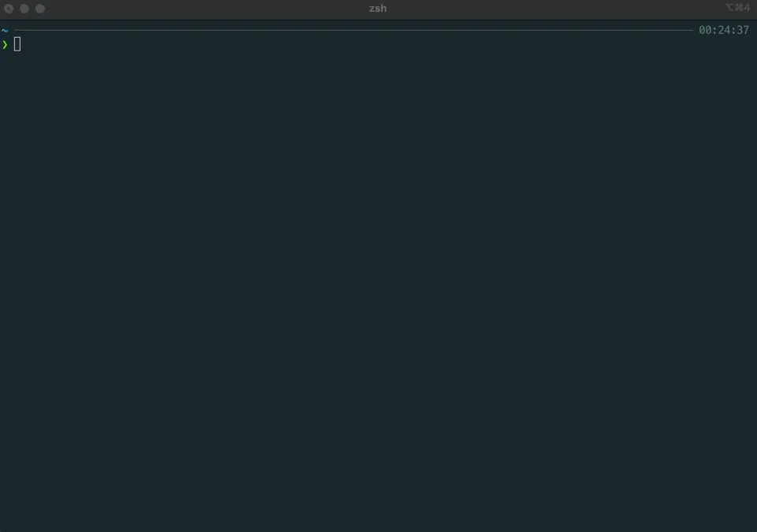

# kubetui

[]()
[](https://github.com/sarub0b0/kubetui/actions/workflows/test.yml)

Kubetui is a terminal user interface (TUI) tool designed for monitoring Kubernetes resources.  
It provides an easy-to-use interface for developers and operators to access important information about their applications and infrastructure.

<details>
<summary>Table of Contents</summary>

- [Features](#features)
- [Installation](#installation)
  - [Homebrew on macOS and Linux](#homebrew-on-macos-and-linux)
  - [Pacman on Arch Linux](#pacman-on-arch-linux)
  - [Scoop on Windows](#scoop-on-windows)
  - [WinGet on Windows](#winget-on-windows)
  - [Chocolatey on Windows](#chocolatey-on-windows)
  - [openSUSE Tumbleweed](#opensuse-tumbleweed)
  - [Using `cargo install`](#using-cargo-install)
  - [Downloading the binary](#downloading-the-binary)
- [Usage](#usage)
  - [Column Customization](#column-customization)
    - [CLI flags (Pod / Node)](#cli-flags-pod--node)
    - [Runtime column dialog (all four tabs)](#runtime-column-dialog-all-four-tabs)
    - [Label columns](#label-columns)
    - [Define presets in config.yaml (Pod / Node)](#define-presets-in-configyaml-pod--node)
  - [Filter (Column-Aware)](#filter-column-aware)
    - [Syntax summary](#syntax-summary)
    - [Inactive terms](#inactive-terms)
    - [Notes per tab](#notes-per-tab)
  - [Shell Completion](#shell-completion)
  - [Clipboard](#clipboard)
  - [Custom Configuration](#custom-configuration)
- [Log Query](#log-query)
  - [Usage Example](#usage-example)
  - [Supported Queries](#supported-queries)
  - [Query String Escaping](#query-string-escaping)
- [Key Bindings](#key-bindings)
  - [General](#general)
  - [Key Map](#key-map)
  - [View Control](#view-control)
  - [Text View](#text-view)
  - [Search Mode](#search-mode)
  - [Table View](#table-view)
    - [Column Dialog](#column-dialog)
  - [Dialog](#dialog)
    - [Context Dialog](#context-dialog)
  - [Input Form](#input-form)
  - [Container Logs View](#container-logs-view)
    - [Inline notices](#inline-notices)
- [Contributing](#contributing)
- [License](#license)

</details>


<details>
<summary>Demo slow version</summary>



</details>

## Features

Kubetui offers the following features to help you monitor and manage your Kubernetes resources:

- **Pods List and Container Logs**: List pods and stream logs from multiple pods/containers at once. Toggle JSON logs between pretty-print and single-line (<kbd>f</kbd>/<kbd>p</kbd>). A powerful Log Query supports regex include/exclude, label/field selectors, resource targeting (e.g. `deployment/app`), and jq/JMESPath post-processing. See [Log Query](#log-query).
- **Node List and Detail**: List nodes with status, roles, age, and version, and view a detail pane for the selected node.
- **ConfigMap and Secret Watching**: Monitor ConfigMaps and Secrets, and decode their data (e.g. Base64).
- **Network-related Resources**: Explore network-related resources and their descriptions.
- **Events Watching**: Stay updated with a real-time view of Kubernetes events (with per-type highlight rules).
- **Arbitrary Resource Watching (List / YAML)**: Select any resource kinds with <kbd>f</kbd> and watch them as a list, or inspect a selected resource's raw YAML with <kbd>y</kbd>.
- **Customizable Columns (Pod / Node / Config / Network)**: Change visible columns and order via a runtime dialog (<kbd>t</kbd>); Pod/Node can also be set at startup with CLI flags and presets. Register labels as columns with `label_columns` — they also become filterable columns. See [Column Customization](#column-customization).
- **Column-aware Filter (Pod / Node / Config / Network)**: `COL:<regex>` to include, `!COL:<regex>` to exclude, `label:<selector>` applied server-side, bare values match `NAME`. Terms on hidden columns become inactive; press <kbd>?</kbd> for inline help. See [Filter](#filter-column-aware).
- **Namespace Multiple Selections**: Select and view multiple namespaces simultaneously.
- **Context Selection**: Switch the Kubernetes context you operate on (with namespace carry-over / caching).
- **Adjustable Split Layout**: Toggle vertical/horizontal pane split at runtime (<kbd>Shift+s</kbd>), or set it at startup with `-s v|h`.
- **Clipboard Support**: Copy text with the mouse; the backend is selectable (`auto`/`system`/`osc52`), and OSC52 works over SSH and tmux. See [Clipboard](#clipboard).
- **Mouse Support**: Click to focus and select, click tabs to switch, scroll with the wheel, and drag to select text for copying.
- **Incremental Search**: Search within text views with <kbd>/</kbd> and jump between matches with <kbd>n</kbd> / <kbd>N</kbd>.
- **(beta) Customizable UI Appearance**: Theme border styles, colors, and text attributes via a config file.

Overall, kubetui is a powerful tool designed to provide a safe and efficient way to access and monitor your Kubernetes resources. With its user-friendly interface and comprehensive features, it simplifies the process of managing your applications and infrastructure.

<!-- TEMP: slim alternative for visual comparison on GitHub — remove before merge -->

## Features (Slim alternative — TEMPORARY, remove before merge)

- **Pods List and Container Logs**: Browse pods and stream their container logs, with JSON pretty-print toggling (<kbd>f</kbd>/<kbd>p</kbd>) and a powerful [Log Query](#log-query) (regex, label/field selectors, resource targeting, jq/JMESPath).
- **Node List and Detail**: View nodes with status, roles, age, and version, plus a detail pane.
- **ConfigMap and Secret Watching**: Monitor ConfigMaps and Secrets, and decode their data.
- **Network-related Resources**: Explore network-related resources and their descriptions.
- **Events Watching**: Stay updated with a real-time view of Kubernetes events.
- **Arbitrary Resource Watching (List / YAML)**: Select any resource kinds with <kbd>f</kbd> and watch them as a list, or inspect a selected resource's raw YAML with <kbd>y</kbd>.
- **Customizable Columns (Pod / Node / Config / Network)**: Pick visible columns and order via a runtime dialog (<kbd>t</kbd>), CLI flags / presets (Pod / Node), and label columns. See [Column Customization](#column-customization).
- **Column-aware Filter (Pod / Node / Config / Network)**: Filter rows by column with include/exclude regex and server-side label selectors, with inline help. See [Filter](#filter-column-aware).
- **Namespace Multiple Selections**: Select and view multiple namespaces simultaneously.
- **Context Selection**: Switch the Kubernetes context you operate on (with namespace carry-over / caching).
- **Adjustable Split Layout**: Toggle vertical/horizontal pane split at runtime (<kbd>Shift+s</kbd>) or at startup (`-s v|h`).
- **Clipboard Support**: Copy text with the mouse; the backend is selectable (system / OSC52, SSH- and tmux-friendly). See [Clipboard](#clipboard).
- **Mouse Support**: Click to focus and select, click tabs to switch, scroll with the wheel, and drag to select text for copying.
- **Incremental Search**: Search within text views with <kbd>/</kbd> and jump between matches with <kbd>n</kbd> / <kbd>N</kbd>.
- **(beta) Customizable UI Appearance**: Theme border styles, colors, and text attributes via a config file.

<!-- END TEMP -->

## Installation

[](https://repology.org/project/kubetui/versions)

To install kubetui, you can use the following methods:

### [Homebrew](https://brew.sh/) on macOS and Linux

Kubetui is available on homebrew, the package manager for macOS and Linux. Install it by running the following command:

```shell
brew install kubetui
```

### [Pacman](https://wiki.archlinux.org/title/pacman) on Arch Linux

Kubetui is available in the [official repositories](https://archlinux.org/packages/extra/x86_64/kubetui/). Install it by running the following command:

```shell
pacman -S kubetui
```

### [Scoop](https://scoop.sh/) on Windows

If you are using Windows with scoop, you can add the necessary buckets and install kubetui with the following commands:

```shell
# Add the 'extras' bucket for vcredist2022
scoop bucket add extras
scoop bucket add <bucket> https://github.com/sarub0b0/scoop-bucket
scoop install <bucket>/kubetui
```

### [WinGet](https://github.com/microsoft/winget-cli) on Windows

If you prefer using winget, the Windows package manager, you can install kubetui with the following command:

```shell
winget install kubetui
```

### [Chocolatey](https://community.chocolatey.org/packages/kubetui/) on Windows

Kubetui is available on Chocolatey, the package manager for Windows. Install it by running the following command:

```shell
choco install kubetui
```

### openSUSE Tumbleweed

For openSUSE Tumbleweed, you can install kubetui using the `zypper` package manager. Run the following command to install:

```shell
zypper install kubetui
```

### Using `cargo install`

Kubetui is available on [crates.io](https://crates.io/crates/kubetui), the official Rust package registry. Install it by running the following command:

```shell
cargo install kubetui
```

Make sure you have [Rust](https://www.rust-lang.org/tools/install) and [Cargo](https://doc.rust-lang.org/cargo/getting-started/installation.html) installed before running the command.

### Downloading the binary

Alternatively, you can download the precompiled binary from the [GitHub Release page](https://github.com/sarub0b0/kubetui/releases) that matches your operating system. Once downloaded, you can run the binary directly without any additional installation steps.

Choose the method that suits your needs and preferences.

## Usage

```sh
kubetui
```

```sh
$ kubetui -h
An intuitive Terminal User Interface (TUI) tool for real-time monitoring and exploration of Kubernetes resources.

Usage: kubetui [OPTIONS] [COMMAND]

Commands:
  completion  Generate completion script

Options:
  -h, --help                                       Print help
  -V, --version                                    Print version
  -A, --all-namespaces[=<true|false>]              Select all namespaces [default: false]
  -c, --context <CONTEXT>                          Context
  -C, --kubeconfig <KUBECONFIG>                    kubeconfig path
      --clipboard <auto|system|osc52>              Clipboard mode (auto, system, or osc52) [env: KUBETUI_CLIPBOARD=] [default: auto]
      --config-file <CONFIG_FILE>                  Config file path
  -l, --logging                                    Logging
  -n, --namespaces <NAMESPACES>                    Namespaces (e.g. -n val1,val2,val3 | -n val1 -n val2 -n val3)
      --node-columns <NODE_COLUMNS>                Comma-separated columns for the node table: builtin names (e.g. name,status), defined label-column names, or "full" for all builtins
      --node-columns-preset <NODE_COLUMNS_PRESET>  Preset name for node columns (e.g. "default", "wide"). If both are specified, `--node-columns` overrides this
      --pod-columns <POD_COLUMNS>                  Comma-separated list of columns to show in pod table (e.g. name,status,ip). Use "full" to show all available columns
      --pod-columns-preset <POD_COLUMNS_PRESET>    Preset name for pod columns (e.g. "default", "full"). If both are specified, `--pod-columns` overrides this
  -s, --split-direction <v|h>                      Window split direction [default: v]
```

### Column Customization

The Pod, Node, Config, and Network tables all support column customization.
Pod and Node additionally support **presets** and a CLI flag for selecting columns at startup; Config and Network use the runtime dialog and label columns.

#### CLI flags (Pod / Node)

```sh
kubetui --pod-columns=name,ready,status,age
kubetui --pod-columns=full           # show all builtin columns
kubetui --pod-columns-preset=default

kubetui --node-columns=name,status,roles,age,version
kubetui --node-columns-preset=wide
```

Notes:

- The `NAME` column is always included even if not specified.
- `full` expands to all builtin columns and cannot be combined with other columns.
- `--pod-columns` overrides `--pod-columns-preset`; same for `--node-columns` / `--node-columns-preset`.

#### Runtime column dialog (all four tabs)

Press <kbd>t</kbd> while a table is focused (Pod / Node / Config / Network) to open the column selection dialog.

- <kbd>Space</kbd> or <kbd>Enter</kbd>: toggle visibility
- <kbd>J</kbd> / <kbd>K</kbd>: reorder columns
- Required columns like `NAME` are always enabled and fixed.

#### Label columns

You can register labels as table columns under `theme.<tab>.label_columns`. Each entry maps a short `name` to a label key. The `name` is used as the upper-cased column header, in the column dialog, and in filter expressions across all four tabs; for Pod and Node it can additionally appear in `--*-columns` flag values and presets. The cell value is taken from `metadata.labels[<label>]`; resources without the label show an empty cell.

```yaml
theme:
  pod:
    label_columns:
      - name: app
        label: app.kubernetes.io/name

  node:
    label_columns:
      - name: zone
        label: topology.kubernetes.io/zone
      - name: instance
        label: node.kubernetes.io/instance-type

  config:
    label_columns:
      - name: instance
        label: argocd.argoproj.io/instance

  network:
    label_columns:
      - name: app
        label: app.kubernetes.io/name
```

Registered label columns are also valid:

- Inside `--pod-columns` / `--node-columns` (e.g. `--node-columns=name,status,zone`).
- Inside presets (interleaved with builtin columns).
- Inside filter expressions (e.g. `app:nginx`, `zone:asia-northeast1-a`).

#### Define presets in config.yaml (Pod / Node)

Define reusable presets under `theme.pod.column_presets` / `theme.node.column_presets`, and set a startup default with `default_preset`.

```yaml
theme:
  pod:
    default_preset: minimal
    column_presets:
      default:
        - name
        - status
        - age
        - ip
        - node
      minimal:
        - name
        - status
        - age

  node:
    default_preset: default
    column_presets:
      default:
        - name
        - status
        - roles
        - age
        - version
      wide:
        - full
      topology:
        - name
        - status
        - roles
        - zone       # label column
        - instance   # label column
```

Resolution order at startup: CLI flag (`--<tab>-columns`) > preset (`--<tab>-columns-preset`) > `theme.<tab>.default_preset` > builtin default.

### Filter (Column-Aware)

Pod, Node, Config, and Network tables share a column-aware filter. Open the filter input with <kbd>/</kbd>, type the expression, and press <kbd>Enter</kbd> to apply (or <kbd>Esc</kbd> to clear the active filter and close the form).

Press <kbd>?</kbd> (or type `help`) inside the filter input to open the per-tab filter help dialog with the columns available in the current tab.

#### Syntax summary

```
TERM [ TERM ]...
```

| Term | Meaning |
| --- | --- |
| `<value>`            | Bare value — treated as `NAME:<value>` (regex include). |
| `NAME:<regex>`       | Include rows whose `NAME` matches. |
| `<COL>:<regex>`      | Include rows whose `COL` matches. |
| `!<COL>:<regex>`     | Exclude rows whose `COL` matches. |
| `label:<selector>`   | Kubernetes labelSelector applied **server-side** (e.g. `label:app=nginx,env=prod`). Last `label:` wins if repeated. |

- **Same column, multiple includes** → OR (in-list): `STATUS:Running STATUS:Pending` → `STATUS in (Running, Pending)`.
- **Different columns, includes** → AND across columns: `NAME:web STATUS:Running` → `NAME~web AND STATUS~Running`.
- **Any matching exclude** → row excluded.
- Column names ignore case, spaces, `-`, and `_`.
- Values with whitespace must be quoted: `STATUS:"CreateContainerConfigError"`. Escape `"`, `'`, or `\` inside quotes with `\`.

#### Inactive terms

A term on a column that is **currently not shown** stays in the filter but is not applied. The title shows `(inactive: COL)` until the column is shown again (e.g. via the column dialog). Unknown columns produce an error.

#### Notes per tab

- **Pod / Config / Network**: `namespace` is not filterable — use the namespace selector (`n` / `N`) instead. A `namespace:<...>` term returns a dedicated guidance message (rather than a generic unknown-column error) in all three tabs.
- **Node**: cluster-scoped, so there is no `namespace` concept; `namespace:<...>` is treated as a plain unknown-column error.

### Shell Completion

Kubetui supports shell completion for Bash and Zsh. You can enable the completion by adding the following to your shell configuration file:

For Bash (add to `~/.bashrc` or `~/.bash_profile`):

```bash
source <(kubetui completion bash)
```

For Zsh (add to `~/.zshrc`):

```bash
source <(kubetui completion zsh)
```

### Clipboard

Kubetui supports three clipboard backends, selectable via `--clipboard` or the `KUBETUI_CLIPBOARD` environment variable:

| Mode     | Behavior                                                                                            |
| -------- | --------------------------------------------------------------------------------------------------- |
| `auto`   | (default) OSC52 when an SSH session is detected (`SSH_CONNECTION` / `SSH_CLIENT` / `SSH_TTY`); otherwise the system clipboard, falling back to OSC52 if unavailable. |
| `system` | Always use the system clipboard (X11 / Wayland / macOS / Windows).                                  |
| `osc52`  | Always emit OSC52 escape sequences — works over SSH and inside `tmux` without a system clipboard.   |

```sh
kubetui --clipboard osc52
KUBETUI_CLIPBOARD=osc52 kubetui
```

### Custom Configuration

You can customize the UI appearance and several feature settings by specifying a configuration file using the `--config-file` flag:

```sh
kubetui --config-file /path/to/your/config.yaml
```

The configuration file can also be located at `$XDG_CONFIG_HOME/kubetui/config.yaml` (or `~/.config/kubetui/config.yaml` when `$XDG_CONFIG_HOME` is unset).

The configuration file allows you to modify:

- **Border Styles**: Customize the border styles of different UI components.
- **Colors**: Change the colors of text, backgrounds, and borders.
- **Text Attributes**: Modify text attributes such as bold, italic, and underline.
- **Per-tab settings**: `theme.pod` / `theme.node` / `theme.config` / `theme.network` accept `label_columns` (register labels as columns and filter terms) and `column_presets` / `default_preset` (Pod and Node only).
- **Status highlights**: `theme.pod.highlights` and `theme.event.highlights` accept regex → style rules.

A sample configuration file is available at `example/config.yaml` to help you get started.

## Log Query

The Log Query feature empowers you to retrieve logs from multiple Pods and their containers. Using regular expressions, selectors, and specified resources, you can precisely define the log retrieval targets. This functionality also allows you to filter logs using regular expressions, providing a powerful and flexible log querying experience.

### Usage Example

```
pod:app container:nginx log:401
```

```
pod:api log:error jq:.message
```

```
pod:api log:error jmespath:message
```

When entering `?` or `help` in the log query form, the help dialog will be displayed.

### Supported Queries

| Query               | Alias                | Description                                                                                                    |
| ------------------- | -------------------- | -------------------------------------------------------------------------------------------------------------- |
| pod:\<regex>        | pods, po, p          | Include Pods that match the regular expression in log retrieval target.                                        |
| !pod:\<regex>       | !pods, !po, !p       | Exclude Pods that match the regular expression from log retrieval target. Can be defined multiple times.       |
| container:\<regex>  | containers, co, c    | Include containers that match the regular expression in log retrieval target.                                  |
| !container:\<regex> | !containers, !co, !c | Exclude containers that match the regular expression from log retrieval target. Can be defined multiple times. |
| log:\<regex>        | logs, lo, l          | Retrieve logs that match the regular expression. Can be defined multiple times.                                |
| !log:\<regex>       | !logs, !lo, !l       | Exclude logs that match the regular expression. Can be defined multiple times.                                 |
| label:\<selector>   | labels               | Include Pods with labels matching the selector in log retrieval target. Cannot be specified with resource.     |
| field:\<selector>   | fields               | Include Pods with fields matching the selector in log retrieval target.                                        |
| jq:\<expr>          |                      | Apply jq filter to JSON logs. Extract fields or restructure output (e.g., `jq:.message`, `jq:{ts:.time}`).    |
| jmespath:\<expr>    | jmes, jm             | Apply JMESPath filter to JSON logs. Simpler syntax for common queries (e.g., `jmespath:message`, `jm:data.id`). |
| limit:\<number>     | lim                  | Override the log buffer size for this query (e.g., `limit:5000`). Takes precedence over `logging.max_lines`.   |
| \<resource>/\<name> |                      | Include Pods belonging to the specified resource in log retrieval target. Cannot be specified with label.      |

Supported resources:

| Resource    | Alias               |
| ----------- | ------------------- |
| pod         | po, pods            |
| replicaset  | rs, replicasets     |
| deployment  | deploy, deployments |
| statefulset | sts, statefulsets   |
| daemonset   | ds, daemonsets      |
| job         | jobs                |
| service     | svc, services       |

### Query String Escaping

When including spaces in queries such as `<regex>` or `<selector>`, enclose the string with `"` or `'`. For example:

```
pod:"a b"
label:"environment in (production, qa)"
```

If you use `"`, `'`, or `\` within the quoted string, escape them with `\`. For example:

```
pod:"a\\b"
```

<details>
<summary>Query Syntax</summary>

```
**Lexer and Parser**

LOG_QUERIES = QUERY ( " "+ QUERY )*

QUERY = POD
        | EXCLUDE_POD
        | CONTAINER
        | EXCLUDE_CONTAINER
        | LOG
        | EXCLUDE_LOG
        | LABEL
        | FIELD
        | JQ
        | JMESPATH
        | LIMIT
        | SPECIFIED_RESOURCE

POD = ( "pods" | "pod" | "po" | "p" ) ":" REGEX
EXCLUDE_POD = "!" POD

CONTAINER = ( "containers" | "container" | "co" | "c" ) ":" REGEX
EXCLUDE_CONTAINER = "!" CONTAINER

LOG = ( "logs" | "log" | "lo" | "l" ) ":" REGEX
EXCLUDE_LOG = "!" LOG

REGEX = QUOTED_STRING | UNQUOTED_STRING

LABEL = ( "labels" | "label" ) ":" SELECTOR
FIELD = ( "fields" | "field" ) ":" SELECTOR

SELECTOR = QUOTED_STRING | UNQUOTED_STRING

JQ = "jq" ":" EXPR

JMESPATH = ( "jmespath" | "jmes" | "jm" ) ":" EXPR

EXPR = QUOTED_STRING | UNQUOTED_STRING

LIMIT = ( "limit" | "lim" ) ":" POSITIVE_INTEGER

POSITIVE_INTEGER = [1-9] [0-9]*

SPECIFIED_RESOURCE = RESOURCE "/" NAME

RESOURCE = ( "pods" | "pod" | "po" )
           | ( "replicasets" | "replicaset" | "rs" )
           | ( "deployments" | "deployment" | "deploy" )
           | ( "statefulsets" | "statefulset" | "sts" )
           | ( "daemonsets" | "daemonset" | "ds" )
           | ( "services" | "service" | "svc" )
           | ( "jobs" | "job" )

NAME = ALPHANUMERIC ( ALPHANUMERIC | "-" | "." )* ALPHANUMERIC

UNQUOTED_STRING = ~['" \t\r\n] ( ~[ \t\r\n] )* // without spaces

QUOTED_STRING = "\"" ESCAPED_STRING "\"" | "'" ESCAPED_STRING "'"

ESCAPED_STRING = ( ESCAPED_CHAR | ~[\"'] )\*

ESCAPED_CHAR = "\\" | "\"" | "\'"
```

</details>

## Key Bindings

### General

| Key                                  | Description                                                         |
| ------------------------------------ | ------------------------------------------------------------------- |
| <kbd>h</kbd>, <kbd>?</kbd>           | Open the dialog for help                                            |
| <kbd>Enter</kbd>                     | Select an item and trigger an event                                 |
| <kbd>n</kbd>                         | Open the dialog for selecting the namespace                         |
| <kbd>N</kbd>                         | Open the dialog for selecting multiple namespaces                   |
| <kbd>c</kbd>                         | Open the dialog for selecting the context                           |
| <kbd>y</kbd>                         | Open the dialog for yaml                                            |
| <kbd>Tab</kbd>, <kbd>Shift+Tab</kbd> | Change the focus of the view within the active tab                  |
| <kbd>number</kbd>                    | Switch to the tab (number: 1~7)                                     |
| <kbd>ESC</kbd>                       | Close the window or terminate the app (when the dialog is not open) |
| <kbd>q</kbd>                         | Terminate the app                                                   |
| <kbd>f</kbd>                         | Open the dialog for selecting multiple API resources                |
| <kbd>Shift+s</kbd>                   | Toggle the split direction between vertical and horizontal          |

### Key Map

| Source                                  | Destination       |
| --------------------------------------- | ----------------- |
| <kbd>Ctrl+p</kbd>                       | <kbd>Up</kbd>     |
| <kbd>Ctrl+n</kbd>                       | <kbd>Down</kbd>   |
| <kbd>Ctrl+f</kbd>                       | <kbd>Right</kbd>  |
| <kbd>Ctrl+b</kbd>                       | <kbd>Left</kbd>   |
| <kbd>Ctrl+u</kbd>                       | <kbd>PgUp</kbd>   |
| <kbd>Ctrl+d</kbd>                       | <kbd>PgDn</kbd>   |
| <kbd>Ctrl+h</kbd>, <kbd>Backspace</kbd> | <kbd>Delete</kbd> |
| <kbd>Ctrl+a</kbd>                       | <kbd>Home</kbd>   |
| <kbd>Ctrl+e</kbd>                       | <kbd>End</kbd>    |
| <kbd>Ctrl+[</kbd>                       | <kbd>Esc</kbd>    |

### View Control

| Key                                                                                          | Description                                        |
| -------------------------------------------------------------------------------------------- | -------------------------------------------------- |
| <kbd>j</kbd>, <kbd>k</kbd>, <kbd>Down</kbd>, <kbd>Up</kbd>, <kbd>PgDn</kbd>, <kbd>PgUp</kbd> | Change the selected item / Scroll the view         |
| <kbd>Left</kbd>, <kbd>Right</kbd>                                                            | Scroll horizontally in the view                    |
| <kbd>g</kbd>                                                                                 | Go to the first item / Go to the top of the view   |
| <kbd>G</kbd>                                                                                 | Go to the last item / Go to the bottom of the view |

### Text View

| Key                          | Description                                                                    |
| ---------------------------- | ------------------------------------------------------------------------------ |
| <kbd>/</kbd>                 | Activate search mode and open the search form                                  |
| <kbd>Enter</kbd>             | Confirm the input                                                              |
| <kbd>q</kbd>, <kbd>Esc</kbd> | Disable search mode and close the search form (**when search mode is active**) |

### Search Mode

| Key                          | Description                     |
| ---------------------------- | ------------------------------- |
| <kbd>n</kbd>, <kbd>N</kbd>   | Go to the next / previous match |
| <kbd>q</kbd>, <kbd>Esc</kbd> | Disable search mode             |

### Table View

| Key                | Description                                                                              |
| ------------------ | ---------------------------------------------------------------------------------------- |
| <kbd>/</kbd>       | Open the filter form (see [Filter](#filter-column-aware) for syntax)                     |
| <kbd>Enter</kbd>   | Apply the filter and close the form                                                      |
| <kbd>Esc</kbd>     | Clear the active filter and close the form                                               |
| <kbd>?</kbd>       | (while filter form is focused) Open the per-tab filter help dialog                       |
| <kbd>t</kbd>       | Open the column selection dialog (Pod / Node / Config / Network)                         |

#### Column Dialog

| Key                                  | Description                       |
| ------------------------------------ | --------------------------------- |
| <kbd>Space</kbd>, <kbd>Enter</kbd>   | Toggle column visibility          |
| <kbd>J</kbd>, <kbd>K</kbd>           | Reorder columns                   |
| <kbd>Esc</kbd>                       | Close the dialog                  |

### Dialog

| Key                                                              | Description                                                         |
| ---------------------------------------------------------------- | ------------------------------------------------------------------- |
| <kbd>Down</kbd>, <kbd>Up</kbd>, <kbd>PgDn</kbd>, <kbd>PgUp</kbd> | Change the selected item / Scroll the view                          |
| <kbd>Tab</kbd>, <kbd>Shift+Tab</kbd>                             | Change the focus of the view within the active tab                  |
| <kbd>Enter</kbd>                                                 | Select an item and trigger an event                                 |
| <kbd>ESC</kbd>                                                   | Close the window or terminate the app (when the dialog is not open) |

#### Context Dialog

| Key                   | Description                                                    |
| --------------------- | -------------------------------------------------------------- |
| <kbd>Enter</kbd>      | Switch context and use previously cached namespaces            |
| <kbd>Ctrl+Space</kbd> | Switch context and preserve current namespaces (if available)  |

### Input Form

| Key                               | Description                                      |
| --------------------------------- | ------------------------------------------------ |
| <kbd>Home</kbd>                   | Move the cursor to the beginning                 |
| <kbd>End</kbd>                    | Move the cursor to the end                       |
| <kbd>Ctrl+w</kbd>                 | Delete text from the cursor to the beginning     |
| <kbd>Ctrl+k</kbd>                 | Delete text from the cursor to the end           |
| <kbd>Left</kbd>, <kbd>Right</kbd> | Move the cursor to the previous / next character |

### Container Logs View

| Key                          | Description                                                        |
| ---------------------------- | ------------------------------------------------------------------ |
| <kbd>f</kbd>, <kbd>p</kbd>   | Toggle between pretty print and single-line display for JSON logs. |
| <kbd>Enter</kbd>             | Insert a blank line.                                               |

#### Inline notices

Two kinds of inline `[kubetui]` lines may appear within the log stream:

- **Yellow `[kubetui] <namespace>: <message>`**: Per-namespace non-fatal notice during setup (e.g. the resource specified by `deployment/<name>` does not exist in some of the selected namespaces). Other namespaces continue to stream logs.
- **Red `[kubetui] <message>`**: A stream-side error encountered while logs are flowing. The stream continues; the error state of the widget is not toggled.

## Contributing

Bug reports and pull requests are welcome.

## License

This software is available as open source under the terms of the [MIT License](https://opensource.org/licenses/MIT).
